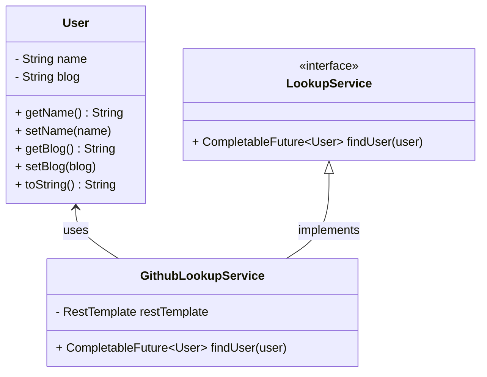

# Async Method

This is a Spring Boot web application designed to asynchronously lookup GitHub user information. It queries GitHub's API to fetch data about users, and the lookup process is handled asynchronously using `CompletableFuture`, allowing for scalable service architecture.

## Features

- **Search for Users**: Users can search for other GitHub users' information, such as their name and blog URL.
- **Asynchronous Search**: The user search is performed asynchronously, allowing the server to handle other requests while waiting for the search results.
- **Feedback on Search**: The system provides feedback that the search is in progress and returns the user data once the lookup is complete.

---

## Technologies Used
- **Java 17**
- **Spring Boot**
- **CompletableFuture for asynchronous operations**
- **REST Template for GitHub API integration**
- **JUnit 5 for unit testing**
- **Mockito for mocking dependencies**
- **SLF4J for logging**

---

## Architecture

Below is the UML Class Diagram that illustrates the structure and relationships of the core classes in this application:


---

## Getting Started

### Prerequisites

Before running this application, ensure you have the following installed:

- **Java 17** or later
- **Maven**

## Installing the project

First you must clone the repository.
```bash
# clone repository
$ git clone https://github.com/herikerbeth/async-method.git

# enter the project folder
$ cd async-method
```

Now, inside IntelliJ, we will install the dependencies with Maven


## Starting
Finally, navigate to the Application class file to run the project.


## Test the Service
To test the service's functionality, run the unit tests:
```bash
$ mvn test
```
The tests will ensure that the asynchronous lookup service works correctly and that the integration with the GitHub API is functioning as expected.

## Source

Based on the official Spring documentation from [Spring.io](https://spring.io/guides/gs/async-method).